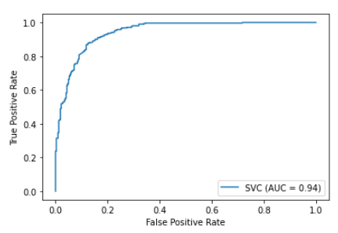

# Subreddit Posts Classification - Don't r/AskCulinary if you just want to r/EatCheapAndHealthy


## Executive Summary
Reddit.com is an online community building platform. Users of Reddit find subreddits of their interests and interact with each other through posting questions or topics to engage discussions. This is how Reddit builds its communities. 

There are currently 430 Million users worldwide with more than half of the traffic from the US. There are also 2.2 million subreddits out there with 130,000 active communities. See the post of [10 Reddit Statistics Every Marketer Should Know in 2020](https://www.oberlo.com/blog/reddit-statistics) for more information. 

With so many subreddits out there, lot of them are actually similar in topics and discussions. In this project, I picked two subreddits of my own interests: r/AskCulinanry and r/EatCheapAndHealthy to perform EDA and classification modeling. My goal is to distinguish posts from one subreddit to another. 


## Folder Structure
```
|__ code
|   |__ CleanupandEDA_EatAsk_title_tvec_vader-withdetailcharts   
|   |__ collectdata_subreddit_AskculinaryEatCheap-Copy1.ipynb  
|   |__ Modeling_AskEat_tvec_BaggingBoosting.ipynb 
|   |__ Modeling_AskEat_tvec_KNearNeighbors.ipynb  
|   |__ Modeling_AskEat_tvec_LogisticRegression.ipynb 
|   |__ Modeling_AskEat_tvec_NaiveBayes.ipynb
|   |__ Modeling_AskEat_tvec_RandomForest.ipynb
|   |__ Modeling_AskEat_tvec_SCM.ipynb
|__ data
|   |__ dsi_project_EatCheapvsAskCulinary.csv
|   |__ eda_2_EatAsk_title.csv
|__ images
|   |__ project3_NC_EDA_pairplot_sentiment_score.png
|   |__ project3_NC_EDA_sentiment_score
|   |__ project3_NC_EDA_sentiment_score_heatmap
|   |__ project3_NC_EDA_title_length_hist
|   |__ project3_NC_EDA_title_wordcount_hist
|   |__ project3_NC_EDA_top15_words_ask
|   |__ project3_NC_EDA_top15_words_eat
|   |__ project3_NC_model_scm_c3_confusion_matrix
|   |__ project3_NC_model_scm_c3_ROC
|__ README.md
|__ subreddit_posts_classification_presentation.pdf

```

## Problem Statement

**Can we catch an unwanted post before it's published?**
    - Between the two subreddits, r/AskCulinary is the one with more strict requests for its members. 
    - r/AskCulinary is a community focus on problem solving, equipment troubleshooting, and skill improvement. 
    - General discussions and recipe requests are posts not wanted within the community.
    - See this [Welcome to /r/
    Culinary! PLEASE READ!](https://www.reddit.com/r/AskCulinary/comments/gdhsl4/welcome_to_raskculinary_please_read/) for more information.

**If we can catch those unwanted posts before it's published, we can adapt one of or all of the follow-up steps below:** 

    - Show users a pop-up message with search result and links based on their post content
    - Show users a pop-up message prompt the user to make the post to recommended subreddits
    - Hold the post for community management's review before releasing it


    
## Raw Data:

The data was gathered through reddit API query from three different days. Including the following data points:

    - title
    - score
    - id
    - url
    - comms_num
    - Created 
    - body

Since we are performing text analysis here, title is picked for clean-up, EDA, preprocessing, and modeling. The field 'body' was considered for preprocessing and modeling as well, but I decided not to move forward because of the following reasons:

    - Many people put nothing in the body. 
    - Many people put their description in the title, and in the body field, they ask people to read title. 
    - People tend to include url and images in the body. Since we are not performing text analysis here, these posts create more noise than signal. 


## Clean Data:

There is no missing data since title is a required field for posting. However, at a point, I did consider using body text for analysis and try to clean up the body text by filling in title to replace empty body and body with only images and url. Halfway into the clean-up process, as I saw and read more body texts, I realized:

    - There are a lot of unexpected texts in body field than I had discovered. 
    - The quality of body text is not better than title text because above described reasons. 

Hence, I decided to went back focus on title text analysis. 


## EDA and Data Preprocessing:

Before performing EDA, I have a few hypothesis regarding this research:

1. Is the length of titles from two subreddits different?
    - Hypothesis: since r/AskCulinary asks its member to be specific with detail, the title of its post should be longer.

2. What are words used or more frequently used in one subreddit than the other?
    - Even though r/AskCulinary asks its members not to request recipes, I assume we will still see the word recipe and recipes often
    - People from time to time need to provide recipe to build the context of their questions.

3. Since r/AskCulinary is more technical, skills, and equipment centric, does the title reflect this orientation?

4. Is the post from either subreddit emotional?
    - Because of the orientation of both subreddits, my hypothesis is:
        - "No, the post shouldn't be emotional or with significant sentiment difference." 

### Explore post length, title length, and title word count
During this EDA process, two new fields were created: 

    - title_length
    - title_word_count

After looking into max/min title_lenght, my observation is that there is not much length difference between posts from both reditts. For example:

**Title Length**
**Field**|**Mean**|**Max**|**Minimal**
:-----:|:-----:|:-----:|:-----:
r/AskCulinary|--|291|5
r/EatCheapAndHealthy|--|267|4

**Title Word Count**
**Field**|**Mean**|**Max**|**Minimal**
:-----:|:-----:|:-----:|:-----:
r/AskCulinary|9.023|56|1
r/EatCheapAndHealthy|9.299|51|1

However, we are seeing max title_length with the most distinguished outcome, when read through the text, the difference is actually not as obvious. When examine the mean title_word_count, we can see the word count is quite the same. 

The similarity is also observed through the distribution of both title_length and title_word_count. 


Based on the observation above, I am rejecting the first hypothesis:

    - Posts from r/AskCulinary are not necessary more lengthy
    - Title length and word counts are actually very similar.

### Them and frequently used word from both subreddits

**TfidfVectorizer** is configured to help me with this part of EDA process. Before removing stop words, the words been used in both subreddits are very similar only slightly different in rankings. After stop words were removed, from the two charts below, I can see the difference of them in discussions. 


Similar observation is made against bigram and trigram search as well. **The top three bigrams from r/EatCheapAndHealthy are 'cheap healthy', 'peanut butter', and 'overnight oats'**, while **observed from r/AskCulinary are 'cast iron', 'sous vide', 'best way'.**  

From frequently used words, bigram, and trigram, I also observed the focus of discussion is different from both subreddits. I am seeing more specific and technical driven tendency in r/AskCulinary. 


### Are posts sentimental or emotional? 

The module SentimentIntensityAnalyzer from Scikit-learn library Vader was utilized to perform sentiment analysis against the title text as a whole. We can see from the chart below that posts from both subreddits are neutral


There is no noticeable difference in score distribution against the two subreddits either. 


Based on the above observation, posts from both subreddit are mostly neutral maybe with a little emotions here and there but no significant signal generated to help with classifying which subreddit posts are from. 


## Modeling:

Title text is the only feature included in this analysis and were modeled with the following Scikit-learn modules:

    - LogisticRegression
    - KNeighborsClassifier
    - DecisionTreeClassifier
    - MultinomialNB
    - LinearSVC 
    - SVC
    - BaggingClassifier
    - RandomForestClassifier
    - AdaBoostClassifier
    - GradientBoostingClassifier 
    - VotingClassifier

Scikit-learn Pipeline and GridSearchCV were used in the modeling process to enhance the efficiency and search through various model parameters to find the best model possible. 


## Results and Evaluation:

After the data was preprocessed with Scikit-learn TfidfVectorizer, the data was further split into train and test sets to perform modeling and evaluation. The accuracy score is adapted here to evaluate the performance of the model. 

**Model**|**Best Training Score**|**Best Testing Score**
:-----:|:-----:|:-----:
LogisticRegression|0.917|0.799
KNeighborsClassifier|0.864|0.751
MultinomialNB|0.9381|0.8235
RandomForestClassifier|0.999|0.8548
BaggingClassifier|0.998|0.820
AdaBoostClassifier|0.9994|0.8296
GradientBoostingClassifier|0.942|0.794
VotingClassifier|0.88|0.772
LinearSVC|--|0.858
Kernel SVC|0.993|0.864
Kernel SVC C3|0.998|0.869

### How well the model is doing?

Model performance was my major concern, considering the similarity in topics. With the test accuracy score of 0.869, the model is doing well a lot better than expected.  We can also examine how model performance through ROC chart. In the graphic below, judging by the area under the ROC curve, the model is pretty good at separating posts from the two classes.
According to the accuracy score, Kernel SVC with C3 is the best model here. 



### SVC C3 Confusion Matrix and Evaluation

Let's take a look at the confusion matrix and further examine the model with sensitivity score, specificity, and precision scores. 

**Model**|**Predicted EatCheap (0)**|**Predicted AskCulinary (1)**
:-----:|:-----:|:-----:
Actual EatCheap|270|52
Actual AskCulinary|31|281

**Metrics**|**Score**
:-----:|:-----:
Accuracy|0.869
Sensitivity|0.90
Specificity|0.8385
Percision|0.8438

With sensitivity and specificity scores, we can now examine the model in the context of the use case described above. With our current model, 281 r/AskCulinary posts and 270 r/EachCheapAndHealthy posts were correctly classified. When we take a look at the 52 false positive and 31 false negative cases here, the impact can be described as:

    - 52 false positive posts: 
        - These posts are actually not wanted and 
        - These posts should be caught before publishing to the discussion board.
        
    - 31 false negative posts: 
        - If the pop-up message application was implemented, 
        - The user of these posts were to receive pop-up messages with links to: 
            - suggested search results or 
            - list of other subreddits to make the post. 

Based on the accuracy score, the ROC chart, confusion matrix, the question "how well the model is doing" is a matter of perspectives not something absolute or concrete. 


## Conclusions:

We have a decent model here with a decent performance. Can we put the result to use? Are we ready to implement the proposed pop-up messages or post-on-hold reviewing mechanism based on the result of this classification model? 

The answer is NO. 

What to improve then? 

Keep in mind the impact described in the confusion matrix session, the "what to improve question" is a tricky one to answer. We can make a goal to improve the accuracy score in general. Or, we can go along with the approach to adjust threshold of the model to improve either the sensitivity or the specificity score. 

One thing to be noted is that if we are focusing on sensitivity or specificity score alone, we might end up either leaking more unwanted posts or annoying more users whose posts are actually legit based on the community posting guideline. 

There is room for improvement for sure, but I don't think we have enough information for actionable next steps at the moment.  


## Next Steps:

Here are three immediate next steps identified: 

- Adapt other tokenize approach to fine tune the data.
- Get more data to train the model to improve the overall performance.
- Have a communication with the community management and members to understand the issue from different perspectives. 
    - To understand whether it makes sense to improve either sensitivity or specificity scores.